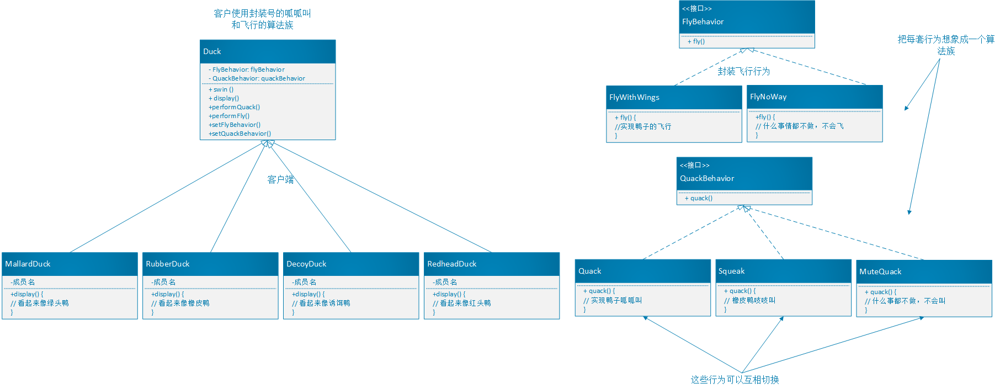

# Java 设计模式

设计模式（Design Pattern）是一套被反复使用、多数人知晓的、经过分类编目的、代码设计经验的总结。使用设计模式是为了可重用代码、让代码更容易被他人理解、保证代码可靠性。

## 设计模式六原则

- 开闭原则（Open Close Principle）
开闭原则就是说对扩展开放，对修改关闭
- 里氏代换原则（Liskov Substitution Principle）
里氏代换原则(Liskov Substitution Principle LSP)面向对象设计的基本原则之一。 里氏代换原则中说，任何基类可以出现的地方，子类一定可以出现。氏代换原则是对“开-闭”原则的补充
- 依赖倒转原则（Dependence Inversion Principle）
这个是开闭原则的基础，具体内容：针对接口编程，依赖于抽象而不依赖于具体。
- 接口隔离原则（Interface Segregation Principle）
使用多个隔离的接口，比使用单个接口要好。降低类之间的耦合度
- 迪米特法则（最少知道原则）（Demeter Principle）
一个实体应当尽量少的与其他实体之间发生相互作用，使得系统功能模块相对独立
- 合成复用原则（Composite Reuse Principle）
原则是尽量使用合成/聚合的方式，而不是使用继

## 设计模式分类

总体来说设计模式分为三大类，GOF定义的是23种设计模式，实际上现在已经不止23种：
- 创建型模式，共五种：（简单工厂）、工厂方法模式、抽象工厂模式、单例模式、构建者模式、原型模式
- 结构型模式，共七种：适配器模式、装饰器模式、代理模式、外观模式、桥接模式、组合模式、享元模式
- 行为型模式，共十一种：策略模式、模板方法模式、观察者模式、迭代模式、责任链模式、命令模式、备忘录模式、状态模式、访问者模式、中介者模式、解释器模式、（空对象）
- J2EE WEB模式， MVC 模式（MVC Pattern）、业务代表模式（Business Delegate Pattern）、组合实体模式（Composite Entity Pattern）、数据访问对象模式（Data Access Object Pattern）、前端控制器模式（Front Controller Pattern）、拦截过滤器模式（Intercepting Filter Pattern）、服务定位器模式（Service Locator Pattern）、传输对象模式（Transfer Object Pattern）、MVVM 模式（MVVM Pattern）

## 设计模式入门（策略模式）

### 鸭子应用类图

  
 

对于鸭子对象与行为，父类来控制游泳与呱呱叫行为直接写具体实现，外观显示`display()`方法抽象出来让每个鸭子自己继承后实现控制，扩展容易，需要鸭子飞的话直接让父类添加飞`fly()`即可。

从继承到接口，将飞`fly()`从父类抽取放进接口，不需要每次都检查功能覆盖，而且能清晰的看到所有鸭子的行为区别，然而重复的代码变多，代码无法复用。
但是39个鸭子都要改飞行怎么办？

### 采取良好的OO软件设计原则

- **找出应用中需要变化(不通用)之处，把他们独立出来，不要和那些不需要变化（通用）的代码混在一起。**
- **针对接口编程，而不是针对实现编程**。
- 从接口到封装隔离
（FlyBehavior）隔离出一个鸭子行为类，去实现需要的行为接口，这样的设计，可以让动作被其它的类复用，因为这些行为和鸭子无关了。
- 从隔离到抽象父类
（Animal）将父类换成抽象类(可以是抽象类，也可以是接口)，这样的意义在于，具体的实现不会被父类绑死，实例化动作不再需要硬编码，而是在运行时指定具体实现的对象，不要关心它具体是鸭子是狗，只要让它叫就可以。
- 整合行为成为变量 将飞行和呱呱叫声明为接口类型的变量，不用鸭子对象不亲自处理呱呱叫的行为，而是委托给`quackBehavior`引用的对象，`quackBehavior`在运行时再通过实例化相应实现类来做出行为。
- 行为变量从静态到动态
在Duck类中添加set方法来随时改动行为变量，这样在运行时构造器实例化为不会飞的鸭子，也能动态改变为火箭动力的鸭子。
- 鸭子到算法族
HAS-A 优于 IS-A
**多用组合(composition)，少用继承**
上述中的飞与呱呱叫行为的组合，使得系统具有很大的弹性，不仅封装算法族为类，还可以运行时改变行为。

>**策略模式(Strategy Pattern)** 定义了算法族，分别封装起来，让他们之间可以相互替换，此模式让算法的变化独立于使用算法的客户。其实就是把容易改动、变化的部分单独拿出来封装，使得这部分改变不影响其它代码，重要概念*多态*

>共享模式词汇 共享模式词汇用更少的词汇做更充分的沟通，用大家都能理解的模式词汇易于沟通。

建立可维护的OO系统，在于随时想到系统可能需要的变化和应付变化的原则。
可复用
可扩充
可维护

>不管当初软件设计得多好，一段时间后，总是需要成长与改变，否则软件就会“消亡”。

### 面向对象汇总工具箱

#### 面向对象基础 OO Basics

- 抽象(Abstraction)
- 封装(Ecapsulation)
- 多态(Polymorphism)
- 继承(Inheritance)

#### 设计原则 OO Principles 比理论上的6种多了3种

- 封装变化 Encapsulate what varies
- 多用组合少用继承Favor composition over inheritence
- 针对接口编程Program to interfaces，not implementations
- 为了交互对象之间的松耦合设计而努力!(Strive for loosely coupled designs between objects that interact.)
- 类应该扩展开放,对修改关闭(Classes should be open for extension but closed for modification.)
- 要依赖抽象,不要依赖具体类(Depend on abstractions,Do not depend on concrete classes.)
- 最少知识原则:只和你的密友谈话(Only talk to your friends.)
- 别打电话给(调用)我,我会打电话给(调用)你(Don't call us,we'll call you.)
- 一个类应该只有一个引起变化的原因(A class should have only one reason to change.)

#### 设计模式 OO Patterns

- Strategy - defines a family of algorithms,encapsulates each one,and make them interchangeable.Strategy lets the algorithm vary independently from clients that use it

### 参考
- [源码地址](https://github.com/jianpenglin/Head-First-Design-Patterns)

## 创建型模式

### 1. 简单工厂（Simple Factory）

#### 说明

在创建一个对象时不向客户暴露内部细节，并提供一个创建对象的通用接口。

#### 使用场景

#### 类图

#### 代码实现

### 2. 工厂方法模式（Factory Method）

#### 说明

#### 使用场景

#### 类图

#### 代码实现

### 3. 抽象工厂模式（Abstract Factory）

#### 说明

#### 使用场景

#### 类图

#### 代码实现

### 4. 单例模式（Singleton）

#### 说明

#### 使用场景

#### 类图

#### 代码实现

### 5. 构建者模式（Builder）

#### 说明

#### 使用场景

#### 类图

#### 代码实现

### 6. 原形模   式（Prototype）

#### 说明

#### 使用场景

#### 类图

#### 代码实现

## 结构型模式

### 1. 适配器模式(Adapter)

### 2. 装饰器模式（Decorator）

### 3. 代理模式（Proxy）

### 4. 外观模式（Facade）

### 5. 桥接模式（Bridge）

### 6. 组合模式（Composite）

### 7. 享元模式(Flyweight)

## 行为型模式

### 1. 策略模式(Strategy)

### 2. 模板方法模式(Template Method)

### 3. 观察者模式(Observer)

### 4. 迭代模式（Iterator）

### 5. 责任链模式（Chain Of Responsibility）

### 6. 模板方法（Template Method）

### 7. 命令模式（Command）

### 8. 备忘录模式（Memento）

### 9. 状态模式（State）

### 10. 中介者模式（Mediator）

### 11. 解释器模式（Interpreter）

### 12. 空对象（Null）

## J2EE WEB 模式

### 1. MVC 模式（MVC Pattern）

### 2. 业务代表模式（Business Delegate Pattern）

### 3. 组合实体模式（Composite Entity Pattern）

### 4. 数据访问对象模式（Data Access Object Pattern）

### 5. 前端控制器模式（Front Controller Pattern）

### 6. 拦截过滤器模式（Intercepting Filter Pattern）

### 7. 服务定位器模式（Service Locator Pattern）

### 8. 传输对象模式（Transfer Object Pattern）

### 9. MVVM模式（MVVM Patter）
